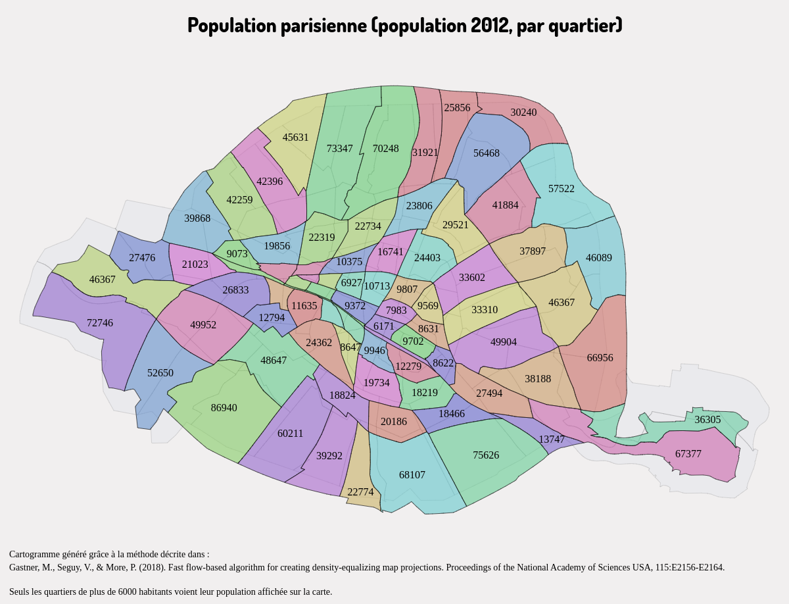

# Cartogramme

Les anamorphoses sont utilisées en cartographie statistique pour montrer l'importance d'un phénomène donné : ce type de carte est couramment appelé un cartogramme.  
Elles permettent de déformer les unités territoriales (polygones) sur la base d'un attribut rapporté à la superficie des entités (densité).  
Trois méthodes de création de cartogrammes sont disponibles dans Magrit :
  - la première, basée sur l'algorithme de Dougenik et al. (1) permet la création de cartogrammes "contigus" (la topologie du fond de carte est préservée tant que possible),
  - la seconde, basée sur l'algorithme de Olson (2) permet la création de cartogrammes "non-contigus" (la méthode ne cherche pas à préserver la topologie du fond de carte),
  - la troisième, basée sur l'algorithme de Gastner, Seguy et More (3) permet la création de cartogrammes "contigus" (la topologie du fond de carte est préservée).

> ### Paramètres (méthode Dougenik)
> * Le nom du champ contenant les valeurs à utiliser
> * Le nombre d'itérations à effectuer avant d'obtenir le résultat
> * Le nom de la couche produite

> ### Paramètres (méthode Olson)
> * Le nom du champ contenant les valeurs à utiliser
> * Le nom de la couche produite

> ### Paramètres (méthode Gastner-Seguy-More)
> * Le nom du champ contenant les valeurs à utiliser
> * Le nom de la couche produite

#### Exemple, méthode (1):

- Méthode de **Dougenik**
- Champ utilisé : **pop2008**
- **5 itérations**

#### Exemple, méthode (3):

- Méthode de **Gaster, Seguy et More**
- Couche utilisée : **Quartiers administratifs de Paris**
- Champ utilisé : **P12_POP**

#### Références

(1) Dougenik, James A.; Chrisman, Nicholas R.; Niemeyer, Duane R. (1985), "An Algorithm to Construct Continuous Area Cartograms", *The Professional Geographer*, 37(1). [doi: 10.1111/j.0033-0124.1985.00075.x](https://doi.org/10.1111/j.0033-0124.1985.00075.x)

(2) Olson, Judy M. (1976). "Noncontiguous Area Cartograms". *The Professional Geographer*, 28(4). [doi: 10.1111/j.0033-0124.1976.00371.x](https://doi.org/10.1111/j.0033-0124.1976.00371.x)

(3) Gastner, Michael T.; Seguy, Vivien; More, Pratyush (2018). "Fast flow-based algorithm for creating density-equalizing map projections". *Proceedings of the National Academy of Sciences USA*, 115:E2156-E2164. [doi: 10.1073/pnas.1712674115](https://doi.org/10.1073/pnas.1712674115)