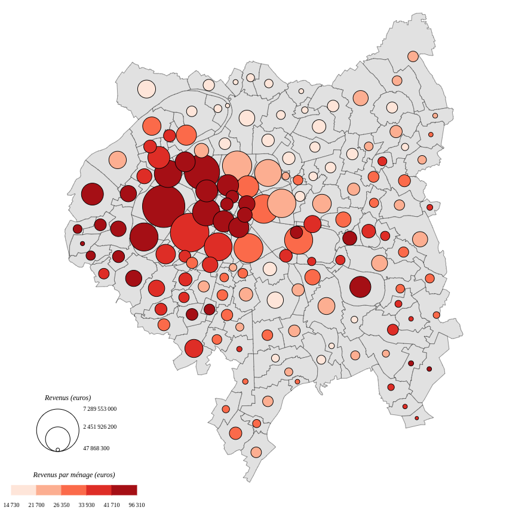
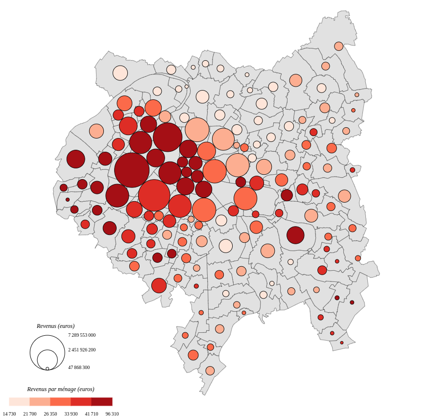

# Carte de stocks et ratios

Ce type de représentation permet de combiner la représentation de données de stocks et celles de ratios sur une même carte.  
La donnée de ratio est représentée à l’intérieur du figuré représentant le stock. 

> ### Paramètres
> * Le nom du champ contenant les valeurs à utiliser pour définir la taille des symboles.
> * La taille (en pixels) à appliquer à la valeur définie à la suite.
> * La valeur sur laquelle fixer la taille.
> * Le type de symbole à utiliser (cercle ou carré).
> * Le souhait ou non d'éviter le chevauchement des symboles (voir plus bas).
> * Le nom du champ contenant les valeurs à utiliser (après discrétisation) pour colorer les symboles.

#### Chevauchement des symboles

Magrit propose une option permettant d'éviter le chevauchement des symboles proportionnels qui sont dessinés.
Cette méthode est empruntée aux cartogrammes de Dorling (utilisation de cercles, cf. (1)) et aux cartogrammes de Demers (utilisation de carrés, cf. (2)).

La méthode utilisée cherche à placer les symboles proportionnels de manière à ce qu'ils ne se chevauchent pas tout en minimisant le déplacement par rapport à leur position initiale.

Il est possible de choisir un nombre d'itérations pour cette option. Plus le nombre d'itérations est élevé, meilleur est le résultat, au détriment d'un temps de calcul plus élevé. Par défaut, lors de la création de la couche, le nombre d'itérations est de 75.

#### Exemple 1 :

#### Exemple 2 :

- Jeu de données : **GrandParisMunicipalites**
- Champ utilisé : **REVENUS**
- Symbole **cercle**
- Éviter le chevauchement des symboles : **Non**
- Taille fixée de **65px** sur la valeur **7289553004,2**
- Champ utilisé pour l'aplat de couleur : **REVENUS_PAR_MENAGE**
- Discrétisation : **Quantiles** / **5 classes**

#### Exemple 3 :

- Jeu de données : **GrandParisMunicipalites**
- Champ utilisé : **REVENUS**
- Symbole **cercle**
- Éviter le chevauchement des symboles : **Oui**
- Taille fixée de **65px** sur la valeur **7289553004,2**
- Champ utilisé pour l'aplat de couleur : **REVENUS_PAR_MENAGE**
- Discrétisation : **Quantiles** / **5 classes**

#### Références

(1) Dorling, D. (1994) Cartograms for visualizing human geography, in D. Unwin and H. Hearnshaw (eds), Visualization and GIS, London: Belhaven Press. 85‐102.

(2) Bortins, I., Demers, S., Clarke, K. (2002) "Cartogram types". Disponible en ligne : [http://www.ncgia.ucsb.edu/projects/Cartogram_Central/types.html](http://www.ncgia.ucsb.edu/projects/Cartogram_Central/types.html).
