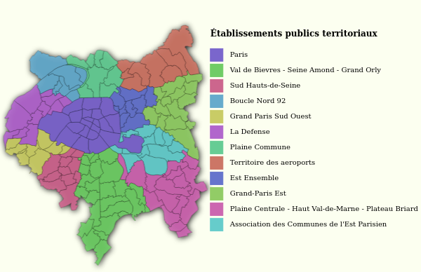
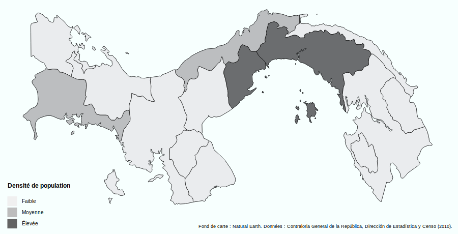

# Carte qualitative

Ce type de carte permet de représenter des entités surfaciques selon la valeur prise par un champ dont les valeurs sont regroupées en catégories.

> ### Paramètres
> * Nom du champ contenant les valeurs à utiliser
> * Choix des couleurs correspondantes aux catégories à représenter

Note : il est possible de réordonner l'ordre d'apparition des modalités dans la légende lors du choix des couleurs et des noms de catégories, en déplaçant chaque ligne à la position souhaitée.

#### Exemple :

- Champ utilisé : **LIBEPT**  

#### Exemple (variable qualitative ordonnée) :

