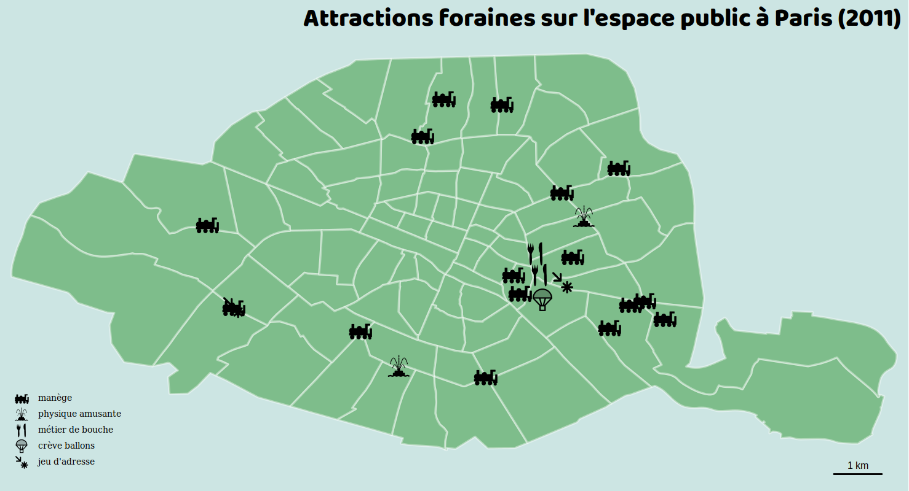

# Carte qualitative (pictogrammes)

Ce type de représentation permet de faire figurer des symboles en fonction des valeurs prises par l'attribut de la couche de données.

> ### Paramètres
> * Le nom du champ contenant les valeurs à utiliser
> * Le choix de pictogrammes correspondants aux différentes catégories à représenter

Note : il est possible de réordonner l'ordre d'apparition des modalités dans la légende lors du choix des symboles et des noms de catégories, en déplaçant chaque ligne à la position souhaitée.

#### Exemple :

